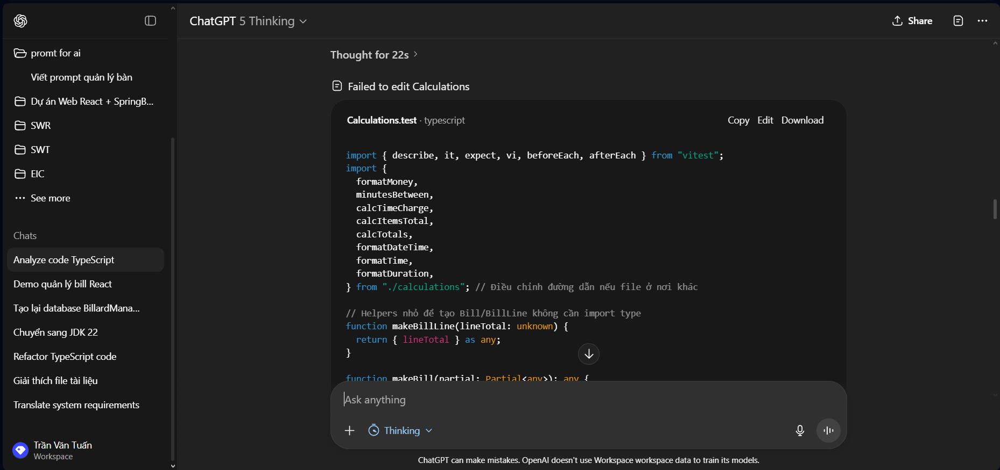
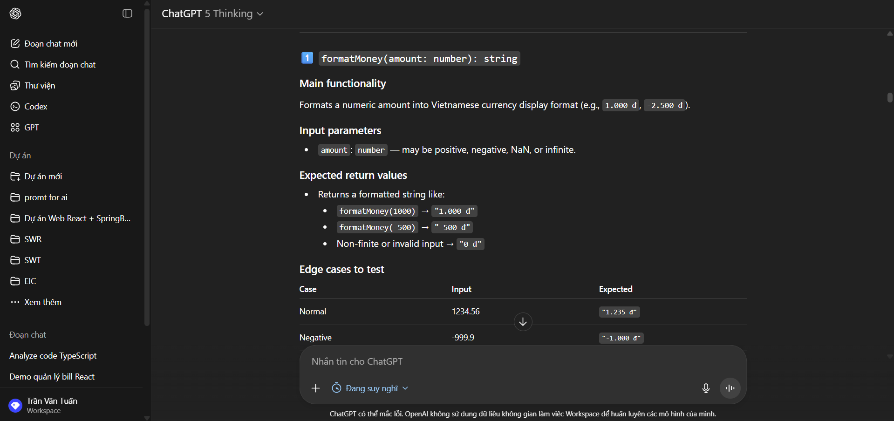
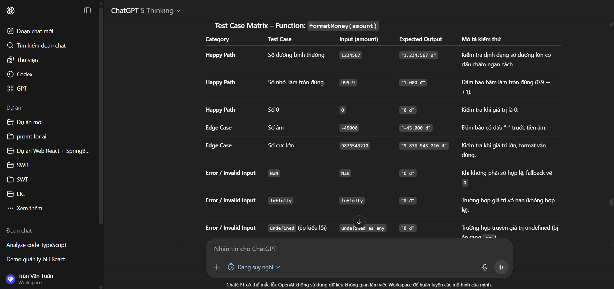
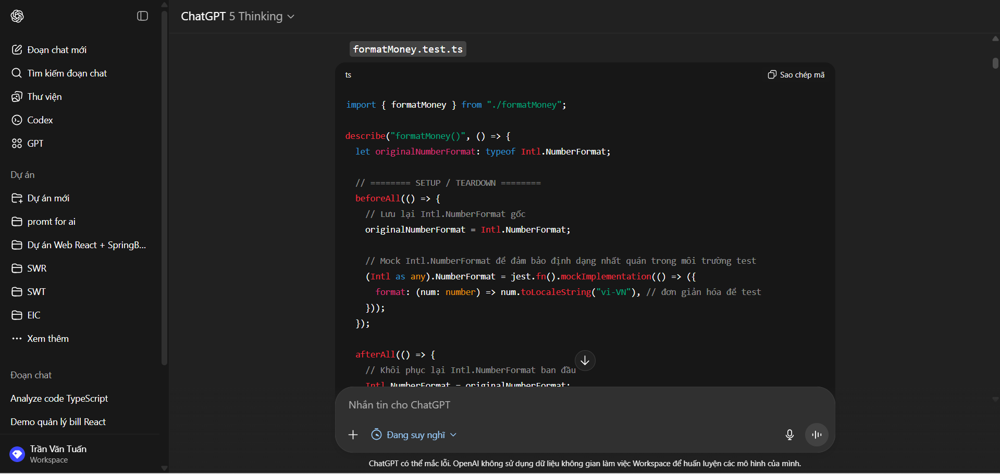
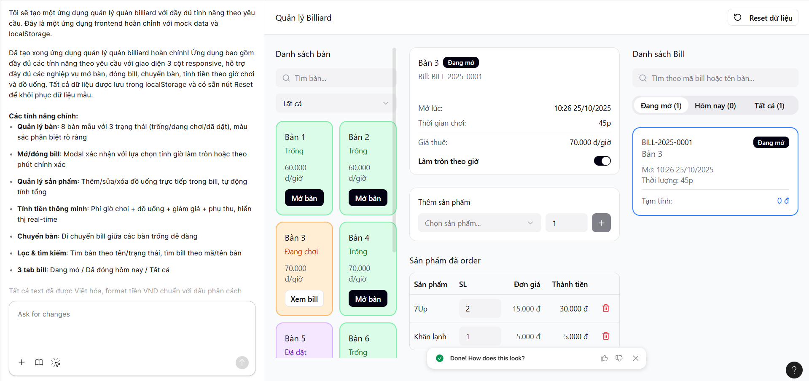

# Các Promt sử dụng :

# Prompt 1 : Sinh function theo yêu cầu 
Vai trò & bối cảnh
Bạn là một senior backend engineer đang phát triển tính năng cho hệ thống quản lý quán billiard. Mục tiêu: viết các hàm phục vụ quản lý bàn và mở/đóng bill, đảm bảo đúng nghiệp vụ, dễ bảo trì, có test.
Ngôn ngữ & stack
•	Ngôn ngữ: [[TypeScript/Node.js]]
•	Runtime/Framework: [[Node 18+, NestJS/Express/…]]
•	Kiểu ngày giờ: [[UTC]]; time zone cửa hàng: [[Asia/Ho_Chi_Minh]]
Mô hình dữ liệu (rõ ràng, có ví dụ)
•	type BTable = {
  		id: string;            // "T01"
   		name: string;          // "Bàn 1"
  		status: "available" | "occupied" | "reserved";
  		pricePerHour: number;  // đơn giá giờ chơi (VND/giờ), vd: 60000
  		note?: string;
};
•	type Product = {
  		id: string;           // "P01"
  		name: string;         // "Nước suối"
  		unitPrice: number;    // VND
  		unit: string;         // "chai", "lon", ...
  		isActive: boolean;
};
•	type BillLine = {
  		productId: string;
  		productName: string;
  		qty: number;
  		unitPrice: number;
  		lineTotal: number;    // qty * unitPrice (tính động)
};
•	type Bill = {
  		id: string;                 // "BILL-2025-0001"
  		tableId: string;            // tham chiếu BTable
  		tableName: string;
  		status: "open" | "closed" | "void";
  		openedAt: string;           // ISO timestamp khi mở bàn
  		closedAt?: string;          // khi kết thúc
  		durationMinutes?: number;   // tính khi đóng bill
  		hourlyRate: number;         // copy từ table.pricePerHour tại thời điểm mở
  		timeCharge?: number;        // phí giờ chơi (tính khi đóng hoặc realtime)
  		items: BillLine[];          // sản phẩm order
  		subTotal: number;           // timeCharge + sum(items)
  		discount: number;           // giá trị giảm (VND)
  		serviceFee: number;         // phụ thu (VND) — optional
  		grandTotal: number;         // subTotal - discount + serviceFee
  		note?: string;
};
Hàm cần sinh (mục tiêu, input/output, ràng buộc)
Viết các hàm sau (mỗi hàm: mô tả, tham số, trả về, lỗi có thể ném, side-effects).
1.	openBillForTable(tableId, pricingPlanId, openerId)
o	Điều kiện: bàn phải FREE hoặc HOLD (nêu khác thì chỉ rõ).
o	Nghiệp vụ: set bàn sang OCCUPIED, tạo bill OPEN, openedAt = now().
o	Chặn mở bill mới nếu bàn đang có bill OPEN.
2.	closeBill(billId, closerId)
o	Tính tổng tiền theo openedAt..now() với PricingPlan.rounding, minChargeMinutes.
o	Chuyển bàn về FREE, clear currentBillId.
3.	switchTable(sourceTableId, targetTableId, operatorId)
o	Chuyển bill đang mở từ bàn A sang bàn B (B phải FREE).
4.	addItemToBill(billId, item) / removeItemFromBill(billId, itemId)
o	Cập nhật tổng tiền hàng hóa (đồ uống, phụ kiện).
5.	getTableStatus(tableId) / listActiveBills(pagination)
o	Trả về dữ liệu tối ưu cho UI.
Yêu cầu kỹ thuật & chất lượng
•	Giao dịch/transaction cho các thao tác nhiều bước.
•	Idempotent: lặp lại request an toàn (ví dụ retry mở bill không tạo bill trùng).
•	Validations: tham số, trạng thái bàn/bill, tồn tại pricing.
•	Concurrency: khoá ở mức hàng (SELECT … FOR UPDATE) hoặc optimistic lock.
•	Timekeeping: mọi tính giờ dùng now() từ provider (để test mock được).
•	Tiền tệ: sử dụng số nguyên cent/vnd (tránh float).
•	Logging & error codes: chuẩn hóa thông điệp lỗi (TABLE_NOT_FREE, BILL_ALREADY_OPEN, …).
•	Performance: ít query dư, index cần thiết.
•	Security: kiểm tra quyền thao tác theo openerId/closerId (nếu có RBAC).
Đầu ra mong muốn
•	Trả về một khối mã duy nhất (ts … ), kèm giải thích.
•	Bao gồm:
o	Implement hàm, type bổ sung (nếu cần), adapter DB (giả lập được),
o	Unit tests bằng [JunitTest] cho happy path + edge cases chính,
Ví dụ nghiệp vụ (few-shot, để AI “bắt sóng”)
•	Mở bill: Bàn #A1 đang FREE, mở lúc 19:03, đơn giá 80k/giờ, làm tròn 5 phút → đến 19:17 tính 15 phút (3 block 5’), tiền giờ = 20k.
•	Đóng bill với min charge: Mở 19:00, đóng 19:06, minCharge=15’, làm tròn 5’ → tính 15’.
•	Chuyển bàn thất bại: nguồn FREE hoặc đích OCCUPIED → lỗi INVALID_SWITCH.
Edge cases bắt buộc test
•	Mở bill khi bàn đã OCCUPIED.
•	Đóng bill đã CLOSED.
•	Pricing không tồn tại / không hợp lệ.
•	Chênh lệch múi giờ / đồng hồ hệ thống.
•	Rounding 1/5/15 phút + min charge kết hợp.

# Prompt 2 : Phân tích code 
Vai trò & bối cảnh
Bạn là Senior QA/Test Engineer. Nhiệm vụ: phân tích lớp Shopping Cart để xác định mọi hàm cần viết unit test và lập kế hoạch kiểm thử chi tiết.

Công việc cần làm
"Analyze this Calculation.ts and identify all functions that need unit testing:

[PASTE YOUR CODE HERE]

For each function, identify:
1. Main functionality
2. Input parameters and types
3. Expected return values
4. Potential edge cases
5. Dependencies that need mocking"
Ví dụ minh hoạ
Function	Mô tả chính	Tham số	Kiểu trả về	Phụ thuộc cần mock	Edge cases chính
addItem	Thêm/ cộng dồn sản phẩm vào giỏ; cập nhật tổng tạm tính	productId: string; qty: number	void	InventoryRepo, PricingService, Date.now	qty ≤ 0; product không tồn tại; vượt tồn kho; tràn số lượng; giá khuyến mãi hết hạn

# Prompt 3 : sin ma trận TestCase
Vai trò & bối cảnh
Bạn là Senior QA/Test Engineer. Nhiệm vụ: viết bộ unit tests toàn diện cho hàm định dạng tiền tệ formatMoney() dùng trong module tính bill.

Đoạn code mục tiêu (FUT – Function Under Test)
export function formatMoney(amount: number): string {
  const n = Number.isFinite(amount) ? Math.round(amount) : 0;
  const sign = n < 0 ? "-" : "";
  const abs = Math.abs(n);
  const formatted = new Intl.NumberFormat("vi-VN", {
    style: "decimal",
    minimumFractionDigits: 0,
    maximumFractionDigits: 0,
  }).format(abs);
  return `${sign}${formatted} đ`;
}
Include :
 Happy paths	Standard formatting, rounding,      negatives	1000 → 1.000 đ,      -500 → -500 đ
 Edge cases	    Boundary values,     large numbers, small fractions	999.5 → 1.000 đ, 1e9 → 1.000.000.000 đ
 Error cases	Non-finite,          NaN,           undefined/null	                 all → "0 đ"
 Integration	Works correctly in cart total computation	verifies function in real use case

 

# Prompt 4 : Sinh Test code từ ma trận TestCase
"Create Jest unit tests for this: export function formatMoney(amount: number): string {
  const n = Number.isFinite(amount) ? Math.round(amount) : 0;
  const sign = n < 0 ? "-" : "";
  const abs = Math.abs(n);

  const formatted = new Intl.NumberFormat("vi-VN", {
    style: "decimal",
    minimumFractionDigits: 0,
    maximumFractionDigits: 0,
  }).format(abs);

  return `${sign}${formatted} đ`;
}
  with these test cases:

Category	        Test Case	                Input (amount)	        Expected Output	Mô tả kiểm thử
Happy Path	   Số dương bình thường	1234567	    "1.234.567 đ"	        Kiểm tra định dạng số dương lớn có dấu chấm ngăn cách.
Happy Path	   Số nhỏ, làm tròn đúng	999.9	"1.000 đ"	            Đảm bảo hàm làm tròn đúng (0.9 → +1).
Happy Path	   Số 0	                0	        "0 đ"	                Kiểm tra khi giá trị là 0.
Edge Case      Số âm	 -45000	                "-45.000 đ"	            Đảm bảo có dấu “-” trước tiền âm.
Edge Case	   Số cực lớn	9.9E+09	            "9.876.543.210 đ"	    Kiểm tra khi giá trị lớn, format vẫn đúng.
Error	       NaN	NaN	                        "0 đ"	                Khi không phải số hợp lệ, fallback về 0.
Error	       Infinity	Infinity	            "0 đ"	                Trường hợp giá trị vô hạn (không hợp lệ).
Error	       undefined (ép kiểu lỗi)		    "0 đ"	                Trường hợp truyền giá trị undefined (bị ép sang     any).

Requirements:
- Use Jest framework
- Include setup/teardown
- Use proper assertions (toEqual, toThrow)
- Add descriptive test names
- Mock any external dependencies"

# Promt 5 : Mock UX/UI với các function đã tạo.
Mục tiêu:
Tạo một app frontend ReactJS (Vite + React, dùng TypeScript nếu có) cho demo quản lý mở bàn billiard và tính bill. Khi chạy dự án, vào thẳng trang Index: “Quản lý Bill” (route /). Không cần trang login. Cho phép quản lý 3 thực thể: Table, Product, Bill (chỉ mock data phía frontend, chưa cần backend thực). UI tiếng Việt.
Tech/UI yêu cầu:
•	React 18+, Vite.
•	Styling: TailwindCSS (ưu tiên), layout tối giản, responsive.
•	Component lib: có thể dùng headless UI hoặc Radix UI; đừng ràng buộc vendor phức tạp.
•	State: React Query (mock fetch) hoặc Context + localStorage.
•	Không bắt buộc router phức tạp; toàn bộ ở trang index.
•	Format tiền: VND (phân tách hàng nghìn), thời gian dạng HH:mm DD/MM/YYYY.
________________________________________
1) MÔ HÌNH DỮ LIỆU (database concept → mock JSON)
Table (bàn billiard)
type BTable = {
  id: string;            // "T01"
  name: string;          // "Bàn 1"
  status: "available" | "occupied" | "reserved";
  pricePerHour: number;  // đơn giá giờ chơi (VND/giờ), vd: 60000
  note?: string;
};
Product (đồ uống/phụ phí)
type Product = {
  id: string;           // "P01"
  name: string;         // "Nước suối"
  unitPrice: number;    // VND
  unit: string;         // "chai", "lon", ...
  isActive: boolean;
};
Bill (hóa đơn theo bàn)
type BillLine = {
  productId: string;
  productName: string;
  qty: number;
  unitPrice: number;
  lineTotal: number;    // qty * unitPrice (tính động)
};

type Bill = {
  id: string;                 // "BILL-2025-0001"
  tableId: string;            // tham chiếu BTable
  tableName: string;
  status: "open" | "closed" | "void";
  openedAt: string;           // ISO timestamp khi mở bàn
  closedAt?: string;          // khi kết thúc
  durationMinutes?: number;   // tính khi đóng bill
  hourlyRate: number;         // copy từ table.pricePerHour tại thời điểm mở
  timeCharge?: number;        // phí giờ chơi (tính khi đóng hoặc realtime)
  items: BillLine[];          // sản phẩm order
  subTotal: number;           // timeCharge + sum(items)
  discount: number;           // giá trị giảm (VND)
  serviceFee: number;         // phụ thu (VND) — optional
  grandTotal: number;         // subTotal - discount + serviceFee
  note?: string;
};
Công thức tính thời gian:
timeCharge = ceil(durationMinutes / 60) * hourlyRate (làm tròn lên theo block 1 giờ)
hoặc cho phép chọn chế độ theo phút: timeCharge = (durationMinutes / 60) * hourlyRate (làm tròn 1 phút).
Yêu cầu: cho phép cấu hình toggle “Tính theo giờ làm tròn” / “Tính theo phút”.
________________________________________
2) TRANG INDEX “QUẢN LÝ BILL” (một trang duy nhất)
Bố cục 3 cột (responsive):
1.	Cột trái: Danh sách Bàn
o	Grid (2–3 cột tùy màn hình): mỗi thẻ bàn hiển thị:
	Tên bàn (vd: “Bàn 1”), trạng thái (màu):
	available = xanh, occupied = cam, reserved = tím.
	Giá giờ chơi (vd: “60.000 đ/giờ”).
	Nút hành động tùy trạng thái:
	Mở bàn (nếu available)
	Xem bill (nếu occupied → focus sang cột giữa bill tương ứng)
	Đặt trước / Hủy đặt (optional)
o	Ô Tìm kiếm/Filter theo trạng thái.
2.	Cột giữa: Bill đang chọn (Detail)
o	Header: Tên bàn + trạng thái + giờ mở bàn (đồng hồ chạy real-time đếm phút).
o	Thông tin tính giờ:
	Hourly rate (đọc-only).
	Toggle: “Làm tròn theo giờ” / “Theo phút”.
	Hiển thị Thời gian chơi (phút) và Phí giờ (timeCharge) (update live).
o	Khu vực thêm sản phẩm:
	Select sản phẩm (searchable), input số lượng, nút “Thêm”.
	Bảng Items: cột SP, SL, Đơn giá, Thành tiền, nút xóa/sửa SL inline.
o	Tổng tiền:
	Tạm tính = timeCharge + sum(items)
	Giảm giá (input VND), Phụ thu (input VND)
	Thành tiền (grandTotal) — hiển thị to, đậm.
o	Action buttons:
	Lưu nháp (giữ trạng thái open, lưu local)
	Tạm dừng (giữ bill nhưng cho phép chuyển bàn khác)
	Đóng bill & In tạm (đặt closedAt, khóa chỉnh sửa)
	Hủy bill (status = void, confirm modal)
o	Chuyển bàn: nút mở modal chọn bàn trống → cập nhật tableId, tableName.
o	Ghi chú bill: textarea.
3.	Cột phải: Danh sách Bill
o	Tabs: Đang mở, Đã đóng (hôm nay), Tất cả.
o	List dạng thẻ hoặc bảng: Mã bill, Bàn, Mở lúc, Thời lượng, Tổng tạm tính/Thành tiền, Trạng thái.
o	Ô tìm kiếm theo mã bill / tên bàn.
o	Click 1 bill → hiển thị chi tiết ở Cột giữa.
Modals/Popovers:
•	Mở bàn: khi click “Mở bàn” trên thẻ bàn:
o	Hiện modal xác nhận: hiển thị Tên bàn, Giá/giờ, chọn chế độ tính (theo giờ/ theo phút).
o	Tạo Bill (status=open) với openedAt = now, hourlyRate = table.pricePerHour.
•	Thêm sản phẩm: có thể inline; nếu modal thì đơn giản, tập trung chọn SP + SL.
•	Đóng bill: modal tóm tắt: thời gian chơi, phí giờ, đồ uống, tạm tính, giảm/thu, thành tiền; xác nhận để set closedAt + status=closed.
•	Chuyển bàn: modal liệt kê bàn available; confirm thay đổi.
Toast/Notif: khi thao tác thành công/thất bại.
________________________________________
3) DỮ LIỆU GIẢ (seed ở frontend)
Tables (8 bàn mẫu):
[
  {"id":"T01","name":"Bàn 1","status":"available","pricePerHour":60000},
  {"id":"T02","name":"Bàn 2","status":"available","pricePerHour":60000},
  {"id":"T03","name":"Bàn 3","status":"occupied","pricePerHour":70000},
  {"id":"T04","name":"Bàn 4","status":"available","pricePerHour":70000},
  {"id":"T05","name":"Bàn 5","status":"reserved","pricePerHour":80000},
  {"id":"T06","name":"Bàn 6","status":"available","pricePerHour":80000},
  {"id":"T07","name":"Bàn 7","status":"available","pricePerHour":90000},
  {"id":"T08","name":"Bàn 8","status":"available","pricePerHour":90000}
]
Products (active):
[
  {"id":"P01","name":"Nước suối","unitPrice":10000,"unit":"chai","isActive":true},
  {"id":"P02","name":"7Up","unitPrice":15000,"unit":"lon","isActive":true},
  {"id":"P03","name":"Sting","unitPrice":15000,"unit":"lon","isActive":true},
  {"id":"P04","name":"Khăn lạnh","unitPrice":5000,"unit":"cái","isActive":true},
  {"id":"P05","name":"Snack","unitPrice":20000,"unit":"gói","isActive":true}
]
Bills (mẫu 1 bill đang mở cho T03):
[
  {
    "id": "BILL-2025-0001",
    "tableId": "T03",
    "tableName": "Bàn 3",
    "status": "open",
    "openedAt": "2025-10-22T18:10:00.000Z",
    "hourlyRate": 70000,
    "items": [
      {"productId":"P02","productName":"7Up","qty":2,"unitPrice":15000,"lineTotal":30000},
      {"productId":"P04","productName":"Khăn lạnh","qty":1,"unitPrice":5000,"lineTotal":5000}
    ],
    "subTotal": 0,
    "discount": 0,
    "serviceFee": 0,
    "grandTotal": 0
  }
]
Lưu ý: subTotal, timeCharge, grandTotal tính động từ UI mỗi lần render/ cập nhật.
________________________________________
4) HÀNH VI & LUỒNG NGHIỆP VỤ
•	Mở bàn:
o	Chỉ cho phép nếu status=available.
o	Sau khi mở: set status=occupied cho Table, tạo Bill(status=open).
•	Thêm sản phẩm:
o	Khi chọn SP và SL > 0, thêm vào items; tính lineTotal.
o	Cho phép sửa SL trực tiếp trong bảng, tự cập nhật lineTotal.
•	Tính giờ:
o	durationMinutes = now - openedAt (phút).
o	Nếu làm tròn theo giờ: ceil(durationMinutes / 60) * hourlyRate.
o	Nếu theo phút: (durationMinutes / 60) * hourlyRate, làm tròn 0 chữ số thập phân khi hiển thị tiền.
o	Hiển thị đồng hồ chạy mỗi 30 giây.
•	Đóng bill:
o	Tính final totals → set closedAt=now, status=closed.
o	Table về available.
•	Hủy bill (void):
o	Không ảnh hưởng doanh thu; Table về available.
•	Chuyển bàn:
o	Chỉ chuyển sang available. Cập nhật Table cũ → available, Table mới → occupied. Cập nhật bill.tableId, bill.tableName.
•	Lưu trữ:
o	Lưu vào localStorage (tables, products, bills). Provide nút “Reset dữ liệu demo”.
________________________________________
5) THÀNH PHẦN UI/COMPONENTS (gợi ý đặt tên)
•	TableCard (thẻ bàn) + TableGrid
•	BillDetailPanel
•	ProductPicker (combobox search)
•	BillItemsTable
•	TotalsPanel
•	OpenTableModal, CloseBillModal, MoveTableModal, ConfirmVoidModal
•	BillsListPanel (có Tabs)
•	Money (format tiền), DurationTicker
________________________________________
6) KIỂM TRA & VALIDATION
•	Không cho SL âm/0; tối đa 999/sp.
•	Khi đóng bill: nếu không có thời lượng (<=0 phút), cảnh báo xác nhận.
•	Trường giảm giá & phụ thu: mặc định 0; không âm; tối đa 2.000.000.
•	Tổng tiền không âm; format VND: 10000 → 10.000 đ.
________________________________________
7) TIỆN ÍCH & HỖ TRỢ DEV
•	Tạo service giả: db.ts (hoặc services/storage.ts) để CRUD từ localStorage.
•	Cung cấp hàm seed dữ liệu mẫu ở lần chạy đầu.
•	Tạo utils: formatMoney, minutesBetween, calcTimeCharge, calcTotals.
________________________________________
8) TIÊU CHÍ HOÀN THÀNH (AC)
•	Chạy npm i && npm run dev vào thẳng trang Quản lý Bill.
•	Có thể:
1.	Mở bàn → phát sinh bill, đồng hồ chạy.
2.	Thêm/sửa/xóa sản phẩm.
3.	Chọn chế độ tính giờ (làm tròn/ theo phút) → tổng thay đổi đúng.
4.	Đóng bill → chuyển vào tab “Đã đóng”.
5.	Hủy bill → chuyển tab “Tất cả” với trạng thái void.
6.	Chuyển bàn → trạng thái bàn cập nhật đúng.
7.	Lưu dữ liệu ở localStorage; có nút Reset.
•	UI sạch, dễ thao tác trên mobile và desktop.
•	Tất cả text tiếng Việt: “Mở bàn”, “Đóng bill”, “Thành tiền”, “Giảm giá”, “Phụ thu”, …
________________________________________
Ghi chú: Tạo đầy đủ component React theo mô tả, kết nối state/mock services để thao tác được ngay. Ưu tiên mã sạch, tách nhỏ component, và xử lý format tiền/thời gian chuẩn.

